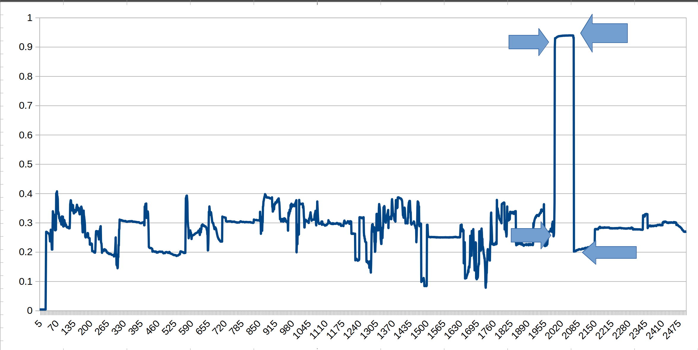

# Auto Intro Detector

This project aims to detect where an intro for an episode of a series 
lies within an episode. 

It will use SSIM to compare frames from the video and a known frame that
marks the end of the the intro. It will then take the ssims of different frames 
compared to the reference frame and detect a large negative drop in the SSIMs which marks the end of the intro and onto a frame for the rest of the episode.

Using the frame number, fps of the video, the first time a large uptick 
and the first large downtick, we can detect the start, duration, and end of an 
intro in an episode. 

What constitutes as "large" is still TBD. 

So far, as a proof of concept I have made a c++ program that serially calculates 
SSIM between two images. If the images are of different sizes, it uses the STBI 
library to resize.

Identical Images should result in a score of 1 and the lower the number the less 
similar the images are
